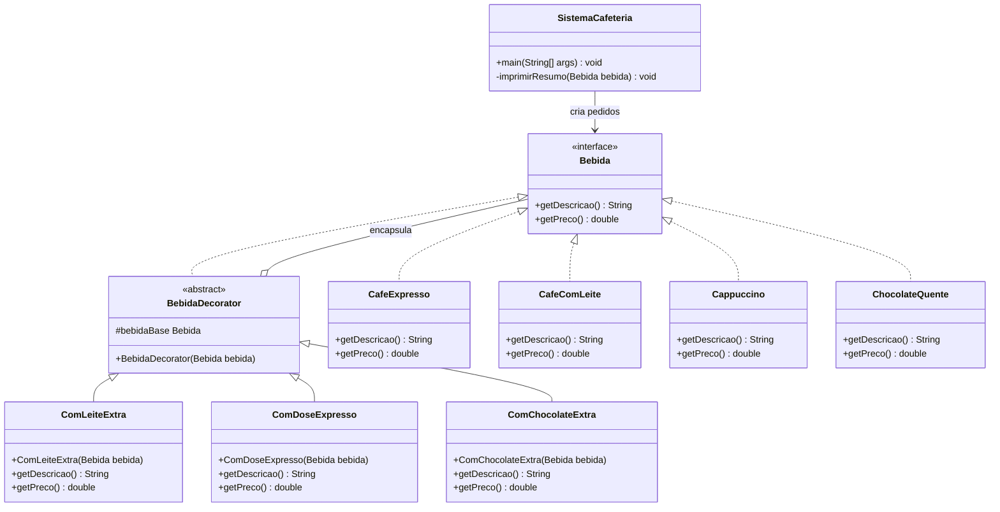

# Café Decorator

Projeto Java que aplica o padrão Decorator para montar bebidas e adicionar complementos sem alterar as classes originais.

## Repositório

[Acesse o repositório no GitHub](https://github.com/luis-sandri/CafeDecorator)

## Objetivo

O sistema calcula descrições e preços de bebidas personalizadas com adicionais encadeados.

## Padrão utilizado

O padrão Decorator adiciona comportamentos a objetos existentes por meio de classes que os encapsulam.

## Estrutura

- `Bebida` define descrição e preço.
- As bebidas concretas implementam `Bebida`.
- `BebidaDecorator` mantém uma bebida-base.
- Os adicionais ampliam descrição e preço da bebida-base.
- `SistemaCafeteria` cria os pedidos e imprime os resumos.

## Diagrama de classes

## Como executar

1. Abra a pasta `src` em uma IDE Java.
2. Execute a classe `SistemaCafeteria`.
3. Consulte o terminal para visualizar cada pedido e seu total.

## Exemplo de saída

## Resultado esperado

O programa monta café expresso, café com leite e cappuccino usando combinações de adicionais.
